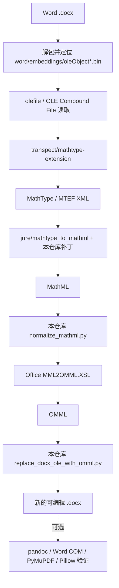

# 依赖与非原创内容审查

这份文档用于 GitHub 发布前审查：把项目中所有依赖、第三方组件、公开标准、平台能力、模板和其他非本项目原创内容列清楚，并判断它们是否有必要保留。

> 说明：这不是法律意见，只是工程发布前的依赖梳理。真正对外发布、vendoring 第三方代码或打包二进制时，仍应做正式许可证审计。

## 结论

当前项目可以“纯程序运行”，不需要 AI 参与每次转换；但它不是“零依赖运行”。最小核心链路必须依赖 OLE 读取、MathType / MTEF 解析、MathML 生成、MathML 到 OMML 转换和 DOCX 回填能力。

发布策略应保持三点：

- 核心 Python 依赖保持最小：`requirements.txt` 只保留核心转换需要的 `olefile`。
- 第三方转换器不直接提交进仓库：通过 `scripts/bootstrap_third_party.ps1` 拉取 `third_party/`。
- 视觉验证依赖按需安装：`PyMuPDF` 和 `Pillow` 放在 `requirements-visual.txt`，不作为默认安装项。

## 范围界定

“非原创内容”在本文中包含以下几类：

- 运行时依赖：Python 包、Java、PowerShell、Office 文件、Git。
- 第三方转换器：`transpect/mathtype-extension`、`jure/mathtype_to_mathml` 及其间接依赖。
- 平台能力：Windows COM、.NET XML/XSLT、ZIP 处理能力。
- 公开标准和格式：DOCX / OOXML / OMML / MathML / OLE Compound File / MathType MTEF。
- 发布维护配置：GitHub Actions、Dependabot、issue/PR 模板。
- 标准文本：MIT License 文本、商标声明、第三方来源链接。

本仓库原创内容主要是：Python/PowerShell 集成脚本、Java 调用包装器、MathML 规范化逻辑、DOCX 回填逻辑、风险分析逻辑、项目文档和第三方 XSLT 的质量补丁。

## 链路图



## 最小核心依赖

这些依赖对“从 MathType OLE 生成可编辑 Word OMML 并回填 DOCX”是必要的。删除任一项，当前完整链路都会中断。

| 名称 | 类型 | 本仓库是否分发 | 用途 | 不使用会怎样 | 处理决定 |
| --- | --- | --- | --- | --- | --- |
| Windows PowerShell | 系统脚本环境 | 否 | 运行 `run_docx_open_source_pipeline.ps1` 和 `probe_formula_pipeline.ps1` | 当前主流程无法编排 | 保留为 Windows-first 前提。 |
| .NET XML / ZIP 组件 | 平台能力 | 否 | PowerShell 中做 XSLT 转换、文件解包和重组 | MathML 转 OMML、DOCX 包处理会缺失 | 跟随 Windows / PowerShell 使用，不单独打包。 |
| Python 3.11+ | 运行时 | 否 | 运行抽取、检查、规范化、回填和风险分析脚本 | 核心脚本无法运行 | 保留为基础运行环境。 |
| `olefile` | Python 包 | 否，仅写入 `requirements.txt` | 读取 OLE Compound File，解析 `oleObject*.bin` | 无法从 OLE 对象取出 MathType 数据 | 必须保留在核心依赖。 |
| Java JDK 17+ | 外部运行时 | 否 | 首次运行时编译 `java_bridge/Ole2XmlCli.java` 并调用转换器 | 无法执行 Java 桥接层 | 当前必须。若未来发布预编译 jar，可降级为 JRE。 |
| `transpect/mathtype-extension` | 第三方项目 | 否，通过 bootstrap 克隆 | 把 MathType OLE / MTEF 数据转换为中间 XML | OLE / MTEF 解析能力缺失 | 必须保留，但不 vendoring。 |
| `jure/mathtype_to_mathml` | 第三方项目 | 否，通过 bootstrap 克隆 | 把 MTEF XML 转换为 MathML | 无法得到 MathML 中间表示 | 必须保留，并保留上游 MIT 许可说明。 |
| Office `MML2OMML.XSL` | Office 附带文件 | 否 | 把 MathML 转换为 Word 原生 OMML | 无法生成可编辑 Word 公式 | 对回填 DOCX 必须，只引用用户本机路径。 |
| Git | 外部工具 | 否 | 克隆第三方仓库、应用补丁、维护版本 | bootstrap 无法自动拉取依赖 | 对自动安装必须；手动准备 `third_party/` 时可不在运行期使用。 |

## 可选依赖

这些依赖增强验证、审查或维护体验，但不是生成 `.omml.docx` 的最低要求。

| 名称 | 类型 | 本仓库是否分发 | 用途 | 是否必要 | 处理决定 |
| --- | --- | --- | --- | --- | --- |
| `pandoc` | 外部工具 | 否 | 生成 LaTeX 验证预览，辅助发现公式结构异常 | 可选 | 保留 `-SkipLatexPreview`，没有它也能生成 DOCX。 |
| Microsoft Word desktop | 外部应用 | 否 | 通过 COM 自动导出 PDF，用于视觉比对 | 可选 | 只在验证阶段要求，不作为核心转换依赖。 |
| `PyMuPDF` | Python 包 | 否，仅写入 `requirements-visual.txt` | 把 PDF 渲染成图片 | 可选 | 不放入默认依赖；因 AGPL/商业双许可，按需安装。 |
| `Pillow` | Python 包 | 否，仅写入 `requirements-visual.txt` | 做图片差异计算和差异标注 | 可选 | 与视觉比对绑定，按需安装。 |

## 第三方转换器与间接依赖

`transpect/mathtype-extension` 自带或引用一组 Java/Ruby 生态组件。这些内容不进入本仓库，但运行时会由用户通过 bootstrap 拉取到本地 `third_party/`。

| 名称 | 来源位置 | 用途 | 必要性 | 风险与处理 |
| --- | --- | --- | --- | --- |
| `MathType2MathML.jar` | `transpect/mathtype-extension/jar/` | 转换器主体 jar | 间接必须 | 不复制进仓库；如果未来要打包，必须先审计 jar 内许可。 |
| `jruby-complete` | `transpect/mathtype-extension/lib/` | 在 JVM 内运行 Ruby gem | 间接必须 | 体积大且许可链复杂，不 vendoring。 |
| `mathtype` gem | `transpect/mathtype-extension/ruby/` | 解析 MathType 二进制并生成 XML | 间接必须 | 本地 gemspec 标注 MIT；保留上游许可文件。 |
| `ruby-ole` gem | `transpect/mathtype-extension/ruby/` | Ruby 侧 OLE 读取 | 间接必须 | 本地 gemspec 标注 MIT；保留上游许可文件。 |
| `bindata` gem | `transpect/mathtype-extension/ruby/` | 声明式读取二进制结构 | 间接必须 | 本地 gemspec 标注 Ruby license；若分发需保留 COPYING。 |
| `nokogiri` gem | `transpect/mathtype-extension/ruby/` | XML 处理 | 间接必须 | 包内含 MIT 许可文件；若分发需保留许可证和 notice。 |

## 本仓库内的派生内容

| 名称 | 是否原创 | 用途 | 是否必要 | 处理决定 |
| --- | --- | --- | --- | --- |
| `patches/mathtype_to_mathml-quality-fixes.patch` | 派生补丁 | 修复本项目验证中遇到的矩阵、根式、上下标等转换质量问题 | 当前必要 | 保留。它作用于第三方 XSLT，仍应尊重 `mathtype_to_mathml` 上游许可。 |
| `java_bridge/Ole2XmlCli.java` | 本仓库原创包装器 | 以命令行方式调用第三方 `Ole2XmlConverter` | 必要 | 保留。它不替代第三方解析器，只做桥接。 |
| Python / PowerShell 集成脚本 | 本仓库原创 | 串联抽取、转换、规范化、回填和验证流程 | 必要 | 保留。 |
| 文档内容 | 本仓库原创为主 | 说明项目定位、安装、限制和发布注意事项 | 必要 | 保留。引用外部项目时保留链接和来源。 |

## 标准、格式与商标引用

这些不是本仓库原创，但也不是要 vendoring 的第三方代码。它们是互操作必须引用的标准、格式或产品名称。

| 名称 | 性质 | 用途 | 是否必要 | 处理决定 |
| --- | --- | --- | --- | --- |
| DOCX / OOXML 包结构 | 文件格式标准 | 定位 `word/document.xml`、relationships、embeddings | 必须 | 保留命名空间和路径引用。 |
| OMML | Word 数学公式 XML 表示 | 回填 Word 原生可编辑公式 | 必须 | 保留。 |
| MathML | 公式中间表示标准 | 承接 MathType 到 Word OMML 的中间层 | 必须 | 保留。 |
| OLE Compound File | 文件容器格式 | 读取 MathType OLE 对象 | 必须 | 保留。 |
| MathType / MTEF | 第三方公式格式 | 从 MathType 对象恢复结构化公式 | 必须 | 保留第三方解析链路；不声称与 MathType 官方有关联。 |
| Microsoft Word / Office 名称 | 商标和产品名 | 说明 `MML2OMML.XSL` 与 Word COM 验证 | 必须引用 | 在 NOTICE 中保持非关联、非背书声明。 |

## 发布维护内容

这些内容不参与本地转换，但对公开 GitHub 项目有维护价值。

| 名称 | 类型 | 用途 | 是否必要 | 处理决定 |
| --- | --- | --- | --- | --- |
| MIT License 文本 | 标准许可证文本 | 授权本仓库原创集成代码 | 必要 | 保留，但不覆盖第三方项目许可。 |
| `NOTICE.md` | 版权和商标说明 | 说明第三方项目、补丁和商标关系 | 必要 | 保留并随依赖变化更新。 |
| GitHub issue / PR 模板 | 平台模板 | 规范 bug、需求和 PR 信息 | 可选但建议 | 保留。 |
| `actions/checkout@v4` | GitHub Action | CI 检出仓库 | 可选但建议 | 保留。 |
| `actions/setup-python@v5` | GitHub Action | CI 安装 Python 3.11 | 可选但建议 | 保留。 |
| Dependabot 配置 | GitHub 服务配置 | 跟踪 pip 和 GitHub Actions 更新 | 可选但建议 | 保留。 |

## 不应进入公开仓库的内容

| 内容 | 原因 | 处理决定 |
| --- | --- | --- |
| 私有或版权不明的 Word 样本文档 | 可能包含版权、隐私或考试内容 | 不提交。 |
| 生成的 DOCX / PDF / PNG / ZIP 输出 | 体积大，且可能泄露输入文档内容 | 不提交。 |
| JDK / JRE 安装包或目录 | 体积大，许可和分发责任复杂 | 不提交。 |
| `third_party/` 完整内容 | 包含上游代码、大 jar、运行时和多重许可 | 不提交，通过 bootstrap 拉取。 |
| Microsoft Office 文件副本 | Office 文件不应由本仓库二次分发 | 不提交，只引用用户本机路径。 |

## 许可与发布风险

| 风险项 | 风险等级 | 原因 | 当前控制措施 | 后续建议 |
| --- | --- | --- | --- | --- |
| `PyMuPDF` 默认安装 | 中 | PyMuPDF 为 AGPL/商业双许可，默认安装会扩大用户许可负担 | 已拆到 `requirements-visual.txt` | README 中继续强调它只用于视觉验证。 |
| `transpect/mathtype-extension` vendoring | 中 | 本地克隆根目录没有单独 LICENSE 文件，且内含多个 jar/gem | 当前不 vendoring | 如果未来要打包，先做完整许可证扫描。 |
| `mathtype_to_mathml` 补丁 | 低到中 | 补丁修改第三方 XSLT，属于派生修改 | 保留 NOTICE 和上游来源 | 可考虑向上游提交 PR，减少长期维护成本。 |
| Office `MML2OMML.XSL` | 中 | 来自 Microsoft Office 安装，不应二次分发 | 只引用用户本机路径 | README 中保持“需要本机 Office 文件”的说明。 |
| 样本文档 | 高 | 文档版权和敏感信息最容易出问题 | 公开仓库零样本文档 | 若需要测试样例，应自造最小 fixture。 |

## 最小安装组合

只做核心转换：

```powershell
python -m pip install -r requirements.txt
powershell -ExecutionPolicy Bypass -File .\scripts\bootstrap_third_party.ps1
```

需要 PDF 视觉比对时再安装：

```powershell
python -m pip install -r requirements-visual.txt
```

没有 `pandoc` 但只需要输出 DOCX：

```powershell
powershell -ExecutionPolicy Bypass -File .\run_docx_open_source_pipeline.ps1 `
  -InputDocx .\input.docx `
  -OutputDir .\out `
  -SkipLatexPreview
```

## 上线前决策

| 决策项 | 当前建议 | 理由 |
| --- | --- | --- |
| 是否提交 `third_party/` | 不提交 | 避免大文件、二进制和复杂许可证进入仓库。 |
| 是否提交视觉依赖到默认 requirements | 不提交 | 核心转换不需要，且 `PyMuPDF` 有更强许可证约束。 |
| 是否保留 bootstrap 脚本 | 保留 | 让用户可复现第三方依赖准备过程。 |
| 是否保留第三方补丁 | 保留 | 当前转换质量依赖它，且 patch 比 vendoring 整个上游更轻。 |
| 是否把项目描述为“全自动无损转换器” | 不应这样描述 | 当前仍是研究型工具链，复杂公式需要抽检。 |

## 公开来源

- `olefile` PyPI 页面：<https://pypi.org/project/olefile/>
- Pillow 官方许可证：<https://github.com/python-pillow/Pillow/blob/main/LICENSE>
- PyMuPDF PyPI 页面：<https://pypi.org/project/PyMuPDF/>
- `jure/mathtype_to_mathml` 许可证：<https://github.com/jure/mathtype_to_mathml/blob/master/LICENSE.txt>
- `transpect/mathtype-extension` 仓库：<https://github.com/transpect/mathtype-extension>
- Transpect 模块说明：<https://transpect.github.io/modules-mathtype-extension.html>

## 最终判断

当前依赖结构适合公开发布，但前提是继续坚持“不 vendoring 大型第三方运行时、不提交样本文档、不默认安装视觉验证依赖”的策略。核心依赖链路有必要；验证和维护依赖有价值但应保持可选；许可证不清晰或体积过大的内容应继续由用户本地安装或 bootstrap 获取。
