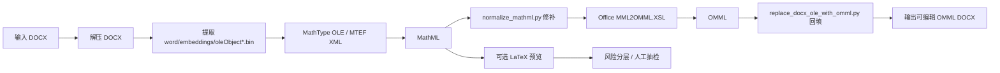
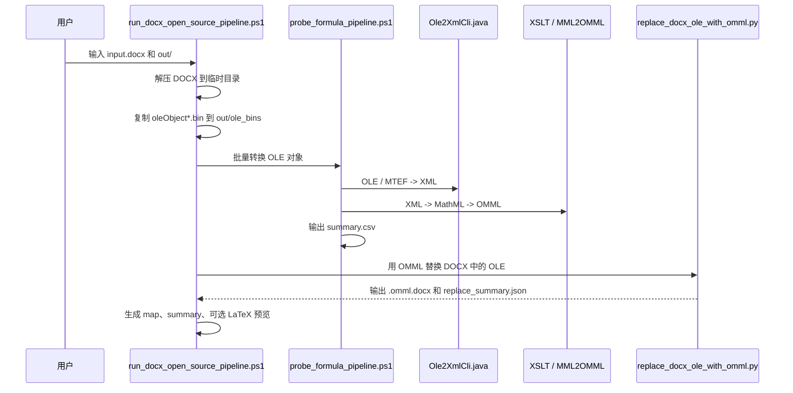
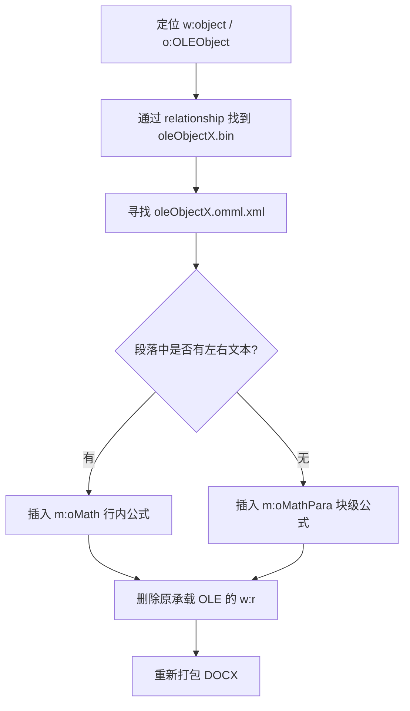
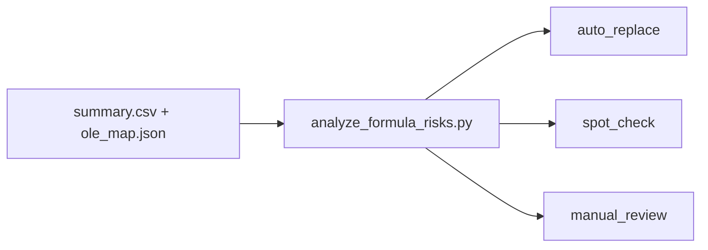
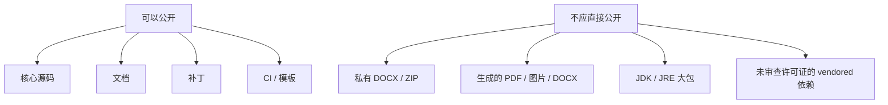

# 项目全景说明

这份文档用于在正式推送 GitHub 前，帮助维护者彻底理解 `document-equation-migration` 的定位、结构、工作流和边界。

## 1. 一句话理解

`document-equation-migration` 是一个 Windows-first 的研究型转换工具链，用来把 Word `.docx` 中以 MathType OLE 对象嵌入的公式转换成 MathML，再转换成 Word 原生 OMML，最后回填成新的可编辑 Word 文档。

它不是 OCR 工具，也不是“任意 Word 公式无损转换器”。它的核心假设是：原文档里仍然保存着 MathType OLE / MTEF 结构化数据，而不是只剩图片。

## 2. 项目边界

这个项目负责：

- 从 `.docx` 里提取 `word/embeddings/oleObject*.bin`。
- 调用第三方 MathType / MTEF 解析链路生成中间 XML。
- 用 XSLT 把中间 XML 转成 MathML。
- 修补已知 MathML 结构问题。
- 用 Office 的 `MML2OMML.XSL` 把 MathML 转成 OMML。
- 把 OMML 写回 `.docx`，生成可编辑公式。
- 输出摘要、映射、LaTeX 预览和风险分层，辅助人工质检。

这个项目不承诺：

- 版式和原稿像素级一致。
- 所有 MathType 公式都语义完全等价。
- 可以在没有 Windows / Office 组件的环境里完整跑完。
- 可以公开再分发用户自己的私有样卷或商业资料。

## 3. 总体链路图



关键点：AI 不参与核心转换。核心转换是文件解包、XML/XSLT 转换、OpenXML 修改和规则化质检。

## 4. 仓库结构

```text
document-equation-migration/
  README.md
  requirements.txt
  run_docx_open_source_pipeline.ps1
  probe_formula_pipeline.ps1
  replace_docx_ole_with_omml.py
  normalize_mathml.py
  analyze_formula_risks.py
  docx_math_object_map.py
  inspect_docx_equations.py
  inspect_ole_streams.py
  extract_equation_native.py
  export_word_pdf.ps1
  compare_pdf_visual.py
  java_bridge/
    Ole2XmlCli.java
  scripts/
    bootstrap_third_party.ps1
  patches/
    mathtype_to_mathml-quality-fixes.patch
  docs/
    architecture.md
    dependencies.md
    limitations.md
    publishing-checklist.md
    project-walkthrough.zh-CN.md
  .github/
    workflows/ci.yml
    ISSUE_TEMPLATE/
```

## 5. 重要文件说明

| 文件 | 作用 |
| --- | --- |
| `run_docx_open_source_pipeline.ps1` | 整篇 `.docx` 的主入口，串起提取、转换、回填和摘要输出。 |
| `probe_formula_pipeline.ps1` | 单批公式对象转换入口，把 `.bin` 转成 XML / MathML / OMML / 可选 LaTeX。 |
| `java_bridge/Ole2XmlCli.java` | Java 包装器，调用第三方 `Ole2XmlConverter`。 |
| `normalize_mathml.py` | 修补常见 MathML 问题，例如上下标底座丢失、函数名拆散。 |
| `replace_docx_ole_with_omml.py` | 修改 Word OpenXML，把原 OLE 公式节点替换为 OMML。 |
| `docx_math_object_map.py` | 把公式对象映射回段落上下文，方便定位和质检。 |
| `analyze_formula_risks.py` | 根据 LaTeX 预览做规则化风险分层。 |
| `scripts/bootstrap_third_party.ps1` | 拉取第三方依赖并应用本项目质量补丁。 |
| `patches/mathtype_to_mathml-quality-fixes.patch` | 保证公开仓库复现本地验证质量的 XSLT 补丁。 |

## 6. 运行前依赖准备

运行完整链路前，需要准备四类东西。

第一类是 Python 依赖：

```powershell
python -m venv .venv
.\.venv\Scripts\python -m pip install -r requirements.txt
```

第二类是第三方转换器：

```powershell
powershell -ExecutionPolicy Bypass -File .\scripts\bootstrap_third_party.ps1
```

这个脚本会克隆两个第三方项目，并给 `mathtype_to_mathml` 应用本仓库的 XSLT 补丁。

第三类是 Java JDK。第一次运行时需要 `javac` 编译 `java_bridge/Ole2XmlCli.java`，所以只装 JRE 不够。

第四类是 Office 的 `MML2OMML.XSL`。默认会尝试查找：

```text
C:\Program Files\Microsoft Office\root\Office16\MML2OMML.XSL
C:\Program Files (x86)\Microsoft Office\root\Office16\MML2OMML.XSL
```

也可以通过 `-Mml2OmmlXsl` 或 `MML2OMML_XSL` 显式指定。

## 7. 主工作流



最常用命令：

```powershell
powershell -ExecutionPolicy Bypass -File .\run_docx_open_source_pipeline.ps1 `
  -InputDocx .\input.docx `
  -OutputDir .\out `
  -MathtypeExtensionDir .\third_party\mathtype-extension `
  -MathTypeToMathMlDir .\third_party\mathtype_to_mathml `
  -Mml2OmmlXsl "C:\Program Files\Microsoft Office\root\Office16\MML2OMML.XSL"
```

如果没有 `pandoc`，但只想得到 `.omml.docx`：

```powershell
powershell -ExecutionPolicy Bypass -File .\run_docx_open_source_pipeline.ps1 `
  -InputDocx .\input.docx `
  -OutputDir .\out `
  -SkipLatexPreview
```

## 8. 输出物如何理解

```text
out/
  ole_bins/
    oleObject1.bin
  converted/
    oleObject1.xml
    oleObject1.mathml
    oleObject1.omml.xml
    oleObject1.tex
    summary.csv
  input.omml.docx
  input.omml.docx.replace_summary.json
  input.omml.ole_map.json
  input.omml.validation.tex
  pipeline_summary.json
  pipeline_summary.txt
  xml_counts.txt
```

| 输出 | 用途 |
| --- | --- |
| `*.omml.docx` | 最重要的结果文件，旧 OLE 公式被替换成 Word 原生公式。 |
| `converted/summary.csv` | 每个公式的转换状态、是否生成 MathML / OMML / LaTeX。 |
| `*.ole_map.json` | 每个公式在文档中的段落位置和上下文。 |
| `*.validation.tex` | 可选 LaTeX 预览，用来快速检查公式语义。 |
| `pipeline_summary.txt` | 整体统计，适合人工快速查看。 |
| `xml_counts.txt` | 检查 `<w:object>` 是否减少、`<m:oMath>` 是否增加。 |

## 9. 回填策略

回填不是简单字符串替换。Word 的数学公式必须放在正确的 OpenXML 结构里。



脚本会保守处理。如果一个运行节点里除了 OLE 对象还有额外混合内容，应该停止而不是强行替换。

## 10. 风险分层

风险分层不是证明公式正确，而是帮你决定哪些公式值得看。



- `auto_replace`：没有触发已知风险规则，通常比较简单。
- `spot_check`：公式较长、带上下标、集合关系、复杂命令等，建议抽看。
- `manual_review`：匹配明显风险模式，例如空上下标、空分母、关系符结尾等。

注意：如果使用 `-SkipLatexPreview`，风险分层价值会下降，因为很多规则依赖 LaTeX 预览。

## 11. 为什么要有第三方补丁

本项目不是从零实现 MTEF 解析，而是复用第三方项目。但是本地验证发现，公开上游的 XSLT 输出在一些场景下不够好，例如：

- 上标槽位映射不准确。
- 矩阵按行列分组不稳定。
- 文本模式字符缺少合适 MathML 包裹。
- 根式缺少专门模板。

因此仓库提供 `patches/mathtype_to_mathml-quality-fixes.patch`。`bootstrap_third_party.ps1` 会自动应用它，确保公开仓库和本地验证路径一致。

## 12. 发布到 GitHub 前应该记住的边界



当前公开仓库采用的是“源码 + 文档 + 补丁 + bootstrap”的策略，不把研究目录里的样卷、JDK、生成产物和对话记录推上 GitHub。

## 13. 推荐维护路线

短期目标：

- 保持 README 诚实描述“研究预览”。
- 增加一个可公开的最小 fixture。
- 让 CI 跑最小转换 smoke test，而不仅仅是语法检查。

中期目标：

- 把 PowerShell 主流程逐步拆成更稳定的 Python CLI。
- 固定第三方依赖 commit，减少上游变动带来的不可复现。
- 增加更多公式类型的回归测试。

长期目标：

- 把 MathML 修补规则系统化。
- 提供更清晰的错误报告和 HTML 审核报告。
- 评估是否把第三方补丁上游化，减少本项目维护成本。
